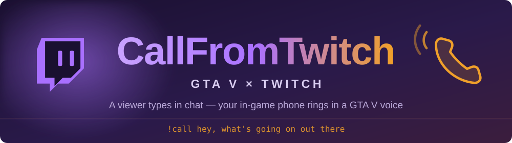

<div align="center">



<p>


</p>

### A viewer types `!call` — your in-game phone rings<br>and speaks in a GTA V character's voice

<sub><a href="#requirements">Requirements</a> · <a href="#installation">Installation</a> · <a href="#running-it">Running it</a> · <a href="docs/configuration.md">Configuration</a> · <a href="docs/twitch.md">Twitch</a> · <a href="docs/troubleshooting.md">Troubleshooting</a></sub>

</div>

---

## What this is

A GTA V mod (SHVDN3): a viewer's message from Twitch chat is spoken in a game
character's voice and delivered as an **incoming phone call**.

```
!call hey, how's it going  ->  Piper TTS  ->  RVC  ->  phone filter  ->  incoming call
      (Twitch)                 (speech)     (timbre)   ("down the line")  (iFruit Jailbreak)
```

A viewer types in chat — a few seconds later the in-game phone rings with their
name on screen. Pick up and you hear their line in the chosen character's voice.
Decline it or miss it, and the line is gone along with the call.

The text source is switched in the config: Twitch chat or the file
`scripts\twitch_test.txt`. Everything runs locally and for free.

<sub>More about how it's built — [docs/internals.md](docs/internals.md)</sub>

## Requirements

| Component | Version | What for |
|---|---|---|
| GTA V | any current one | the game itself |
| [ScriptHookV](http://www.dev-c.com/gtav/scripthookv/) | matching your game version | native mod loader |
| [ScriptHookVDotNet3](https://github.com/scripthookvdotnet/scripthookvdotnet/releases) | 3.6.0 | C# scripts (the DLL is already in the repo) |
| [iFruit Jailbreak](https://github.com/sruckstar/iFruitJailbreak) | 5.0+ | incoming call screen; `iFruit Jailbreak.dll` in `scripts\` |
| .NET Framework | 4.8 | the mod's runtime |
| Python | **3.10** | voice server (`fairseq` won't build on 3.11+) |
| GPU | ~2 GB VRAM | real-time RVC (CPU works too, but slowly) |
| [MSVC Build Tools](https://visualstudio.microsoft.com/visual-cpp-build-tools/) | 2019+ | `fairseq` builds a C extension from source |

## Installation

One PowerShell command — it clones the repository and adds the `cft` command:

```powershell
irm https://raw.githubusercontent.com/sruckstar/CallFromTwitch/main/bootstrap.ps1 | iex
```

Then, in order:

```powershell
cft install    # voice server: venv, PyTorch+CUDA, Piper, RVC (asks for a drive; several GB)
cft deploy     # build the mod and drop it into GTA V (finds the game on its own)
cft config     # settings: channel, voice, call
```

### Voice models

The models are hundreds of megabytes, so they are **not** in the repository —
`cft install` downloads them:

| | Where it comes from | Size |
|---|---|---|
| Piper (speech) | [rhasspy/piper-voices](https://huggingface.co/rhasspy/piper-voices), fetched by `piper.download_voices` | ~110 MB |
| RVC (character timbre) | the links in [`voice_server/voices.json`](voice_server/voices.json) | ~150 MB each |

If a download fails, the install still finishes — calls just use the plain Piper
voice until a character model is there. To fetch them separately:

```bat
cft voices              download every voice in voices.json
cft voices --list       what is available and what is already installed
cft voices Michael      just one
cft voices --url <link> Lamar    install a voice from a link directly
```

Any RVC model works, whether or not the manifest lists it: drop it into
`voice_server\models\rvc\<Name>\<model>.pth` (keep the matching `.index`
alongside) and the voice is named after its folder.

## Running it

```bat
cft start        start the server (keep the window open, wait for `Ready - start GTA V`)
```

Then start GTA V and give the mod some text:

- **from chat:** a viewer types `!call hey, what's up` — needs `[Twitch] Enabled = true`
  and `Channel`

Other commands:

```bat
cft status       what's installed and whether the server responds
cft voices       download or re-download the character voices
cft where        which copy of GTA V the mod goes into
cft config       mod settings without a text editor
cft uninstall    remove the installed environment
```

## Licenses

Piper — GPL-3.0 · RVC — MIT · NAudio — MIT · iFruit Jailbreak — a separate mod.
